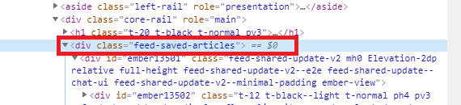
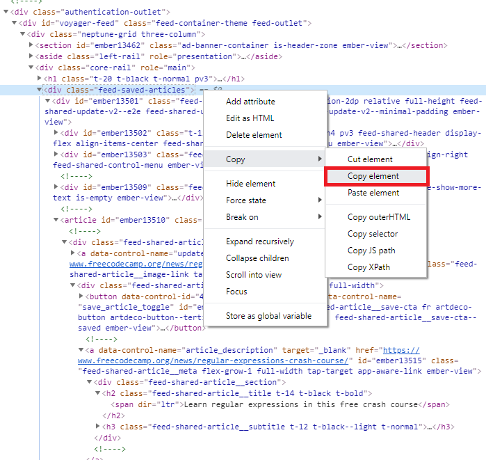

# LinkedIn Duplicate Article Finder
This project for finding duplicate articles on your LinkedIn account

**Always open for improvements.**
=======

### Read before start using
1. Go your saved articles page and go bottom of your list.
2. Right Click on first article on your page and click **Inspect**.
3. Find **"feed-saved-articles"** on inspect page.
4. Right Click on "feed-saved-articles" line and Click Copy->Copy Element
5. Paste copied file into linkedinHTMLfile.txt
6. **Ready to go!**
> I put my html elemnt into linkedinHTMLfile.txt for tests you can delete inside linkedinHTMLfile.txt and paste your copied file

